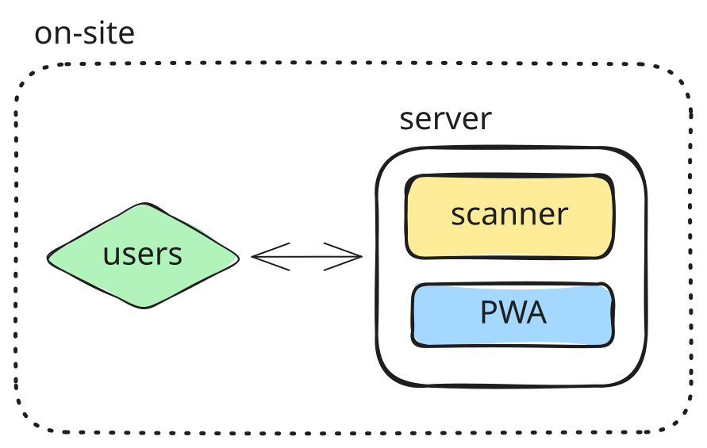
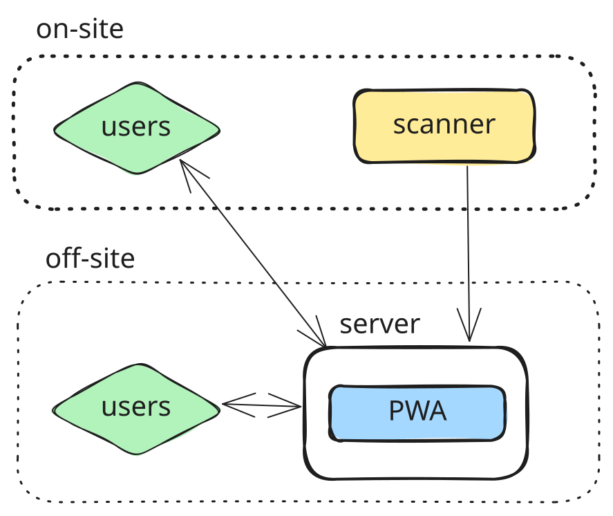
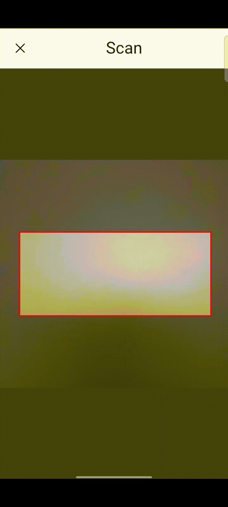
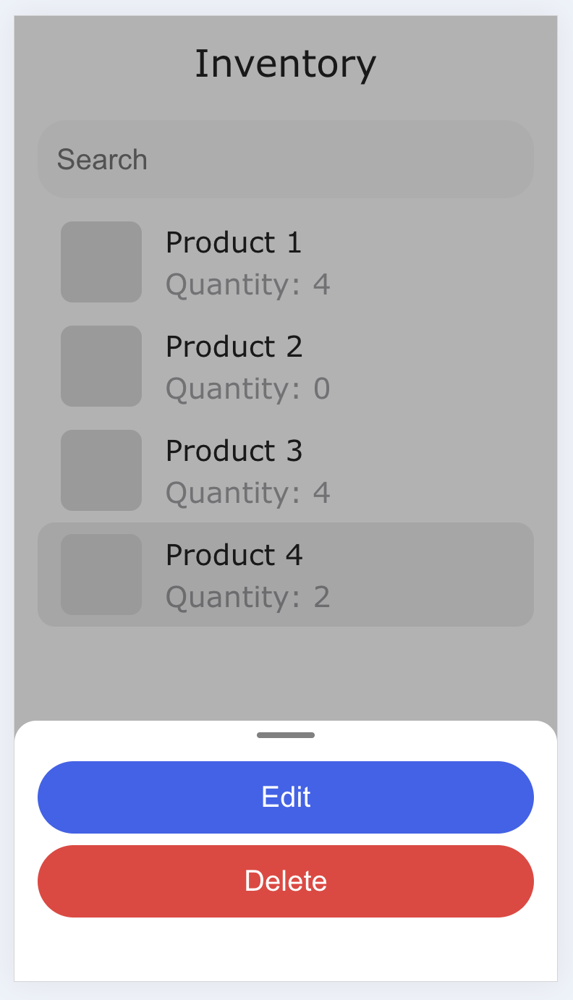

# Inventory-tracker

Application to keep track of inventory of any kind, using barcodes as item identifiers. It is composed of:

- **server**: provides access to the inventory, adding/updating items.
- **client** (pwa): allows registering new items via barcode, and displays inventory information.
- **scanner**: can be integrated as part of the server. Is a physical device to read barcodes and perform inventory updates, and is supposed to be located next to the inventory location.

## System Architecture

The main constraint is that the scanner must me on-site. Depending on where the server is located, two architectures can be defined:

- The server is also on-site, so the scanner would be part of it
- The server is independent, in a different location

### Server on-site

In this case, the server would be inside the internal network, so:

- Users (accesing from the PWA served from the server) would also need to be connected to the same internal network.
- The application would only be accessible from within the network (on-site).
- Setup is easier, and security less demanding, as requests will only be performed from within.
- Need physical access to the server to update its software.

<div align="center">
  
</div>

### Server off-site

The server would be deployed elsewhere, so:

- It is now exposed on the internet, accessible by anyone, so security is a concern.
- Increased complexity, as the scanner is now independent and needs to communicate with the server.
- The application would now be accesible from anywhere.
- Software updates can easely be rolled out.

<div align="center">
  
</div>

## Application flow

### Registering new items

The first step is to register the items for which we wish to track inventory. The steps are the following:

1. **[client]** A new item is scanned using the web-app, obtaining its code-id
2. **[client]** A request is sent to the server to fetch information related to the code-id
3. **[server]** The server queries the code to find product information (name), currently via scraping
4. **[client]** A form is created, using the retrieved information as default values, and sent back to the server
5. **[server]** The new item is registered in the db

<div align="center">
  <br />
  
</div>

### Removing items from inventory

When an item is removed from inventory, it needs to be scanned so inventory is updated. The steps are the following:

1. **[scanner]** A code is read, and a `decrease` request is sent to the server
2. **[server]** It first checks that the product exists, and updates its quantity by `-1`
3. **[server]** If the new quantity is below its configured threshold, an email is sent to the administrator with the full list of items whose quantity is also below threshold

### Updating item information

Users can access the web-app to check the list of products, update information for any of them, or delete them.
This flow is mainly used to update the quantity of an item, after re-stocking.

<div align="center">
  <br />
  
</div>

## Development

### Scanner

Debugging scanner events for connecting/disconnecting device:

```sh
sudo udevadm monitor --udev
```

In our scanner we will assume the device is connected when the server starts up.

## Packaging

### Logging

Once packaged into the raspberrypi zero, it is not longer possible to check logs unless having physical access to the raspi (screen, ssh-ing).
Without using a Saas to send and check the logs, a straightforward way to achieve this with the current setup is to send them to a new collection in the mongodb we are already using (assuming o cloud version).

To do this, we could modify [our logger](./apps/server/src/modules/logger.ts) to allow changing the `stream` used for logging:

```diff
@@ /modules/logger.ts @@

+export const setStream = (stream: LoggerStream) => {
+  _stream = stream;
+};
```

And the update the stream when the db connection is stablished:

```diff
@@ /modules/db.ts @@

  await mongoose.connect(connectionUri).then(
-    () => log.info(`Database connection to [${database}] established`),
+    () => {
+      log.info(`Database connection to [${database}] established`);
+      const dbStreamer = getDbStreamer();
+      setStream(dbStreamer);
+    },
    ...

+ const getDbStreamer = (): { write: (m: string) => void } => {
+   const schema = new mongoose.Schema({}, { strict: false });
+   const Model = mongoose.model("server_logs", schema);
+   return {
+     write: (message: string) => Model.create({ message }).catch(console.log),
+   };
+ };
```
